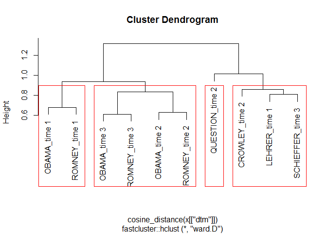
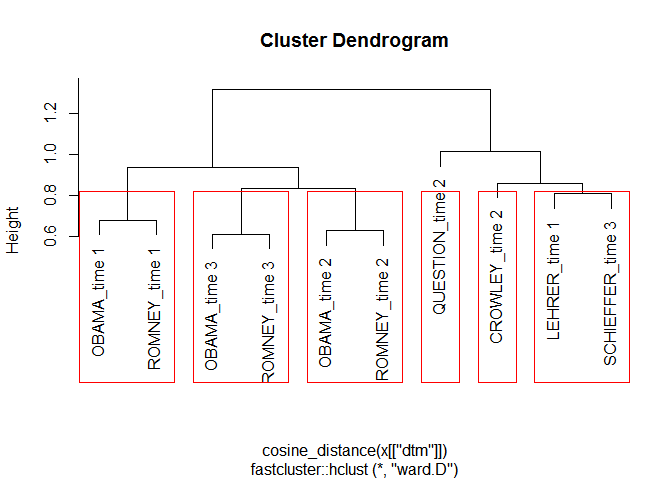
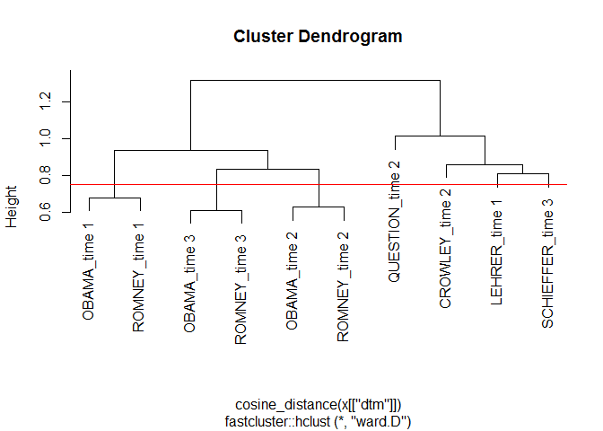

hclustext
============

**hclustext** is a collection of optimized tools for clustering text
data via hierarchical clustering. There are many great R [clustering
tools](https://cran.r-project.org/web/views/Cluster.html) to locate
topics within documents. I have had success with hierarchical clustering
for topic extraction. This package wraps many of the great R tools for
clustering and working with sparse matrices to aide in the workflow
associated with topic extraction.

The general idea is that we turn the documents into a matrix of words.
After this we weight the terms by importance using
[tf-idf](http://nlp.stanford.edu/IR-book/html/htmledition/tf-idf-weighting-1.html).
This helps the more salient words to rise to the top. We then apply
cosine distance measures to compare the terms (or features) of each
document. Cosine distance works well with sparse matrices to produce
distances metrics between the documents. The hierarchical clustering is
fit to separate the documents into clusters. The user then may apply k
clusters to the fit, clustering documents with similar important text
features. The documents can then be grouped by clusters and their
accompanying salient words extracted as well.

Table of Contents
============

-   [[Function Usage](#function-usage)](#[function-usage](#function-usage))
-   [[Installation](#installation)](#[installation](#installation))
-   [[Contact](#contact)](#[contact](#contact))
-   [[Demonstration](#demonstration)](#[demonstration](#demonstration))
    -   [[Load Packages and Data](#load-packages-and-data)](#[load-packages-and-data](#load-packages-and-data))
    -   [[Data Structure](#data-structure)](#[data-structure](#data-structure))
    -   [[Hierarchical Cluster](#hierarchical-cluster)](#[hierarchical-cluster](#hierarchical-cluster))

Function Usage
============

The main functions, task category, & descriptions are summarized in the
table below:

<table style="width:160%;">
<colgroup>
<col width="34%" />
<col width="23%" />
<col width="101%" />
</colgroup>
<thead>
<tr class="header">
<th align="left">Function</th>
<th align="left">Category</th>
<th align="left">Description</th>
</tr>
</thead>
<tbody>
<tr class="odd">
<td align="left"><code>data_store</code></td>
<td align="left">data structure</td>
<td align="left"><strong>hclustext</strong>'s data structure (list of dtm + text)</td>
</tr>
<tr class="even">
<td align="left"><code>hierarchical_cluster</code></td>
<td align="left">cluster fit</td>
<td align="left">Fits a hierarchical cluster model</td>
</tr>
<tr class="odd">
<td align="left"><code>assign_cluster</code></td>
<td align="left">assignment</td>
<td align="left">Assigns cluster to document/text element</td>
</tr>
<tr class="even">
<td align="left"><code>get_text</code></td>
<td align="left">extraction</td>
<td align="left">Get text from various <strong>hclustext</strong> objects</td>
</tr>
<tr class="odd">
<td align="left"><code>get_dtm</code></td>
<td align="left">extraction</td>
<td align="left">Get <code>tm::DocumentTermMatrix</code> from various <strong>hclustext</strong> objects</td>
</tr>
<tr class="even">
<td align="left"><code>get_removed</code></td>
<td align="left">extraction</td>
<td align="left">Get removed text elements from various <strong>hclustext</strong> objects</td>
</tr>
<tr class="odd">
<td align="left"><code>get_terms</code></td>
<td align="left">extraction</td>
<td align="left">Get weighted important terms from an <strong>assign_cluster</strong> object</td>
</tr>
</tbody>
</table>

Installation
============

To download the development version of **hclustext**:

Download the [zip
ball](https://github.com/trinker/hclustext/zipball/master) or [tar
ball](https://github.com/trinker/hclustext/tarball/master), decompress
and run `R CMD INSTALL` on it, or use the **pacman** package to install
the development version:

    if (!require("pacman")) install.packages("pacman")
    pacman::p_load_gh(
        "trinker/textshape", 
        "trinker/gofastr", 
        "trinker/termco",    
        "trinker/hclustext"
    )

Contact
=======

You are welcome to:   
* submit suggestions and bug-reports at: <https://github.com/trinker/hclustext/issues>   
* send a pull request on: <https://github.com/trinker/hclustext/>  
* compose a friendly e-mail to: <tyler.rinker@gmail.com>

Demonstration
=============

Load Packages and Data
----------------------

    if (!require("pacman")) install.packages("pacman")
    pacman::p_load(hclustext, dplyr, textshape)

    data(presidential_debates_2012)

Data Structure
--------------

The data structure for **hclustext** is very specific. The
`data_storage` produces a `DocumentTermMatrix` which maps to the
original text. The empty/removed documents are tracked within this data
structure, making subsequent calls to cluster the original documents and
produce weighted important terms more robust. Making the `data_storage`
object is the first step to analysis.

We can give the `DocumentTermMatrix` rownames via the `doc.names`
argument. If these names are not unique they will be combined into a
single document as seen below.

    ds <- with(
        presidential_debates_2012,
        data_store(dialogue, doc.names = paste(person, time, sep = "_"))
    )

    ds

    ## Text Elements      : 2,912
    ## Elements Removed   : 0
    ## Documents          : 10
    ## Terms              : 3,369
    ## Non-/sparse entries: 7713/25977
    ## Sparsity           : 77%
    ## Maximal term length: 16

Hierarchical Cluster
--------------------

Next we can fit a hierarchical cluster model to the `data_store` object
via `hierarchical_cluster`.

    myfit <- hierarchical_cluster(ds)

    myfit

    ## 
    ## Call:
    ## fastcluster::hclust(d = cosine_distance(x[["dtm"]]), method = method)
    ## 
    ## Cluster method   : ward.D 
    ## Number of objects: 10

This object can be plotted with various `k` or `h` paremeters specified
to experiment with cutting the dendrogram. This cut will determine the
number of clusters or topics that will be generated in the next step.
The visual inspection allows for determining how to cluster the data as
well as determining if a tf-idf, cosine, hierarchical cluster model is a
right fit for the data and task. By default `plot` uses an approximation
of `k` based on Can & Ozkarahan's (1990) formula (*m* \* *n*)/*t* where
*m* and *n* are the dimensions of the matrix and *t* is the length of
the non-zero elements in matrix *A*.

-   Can, F., Ozkarahan, E. A. (1990). Concepts and effectiveness of the
    cover-coefficient-based clustering methodology for text databases.
    *ACM Transactions on Database Systems 15* (4): 483.
    <doi:10.1145/99935.99938>

<!-- -->

    plot(myfit)

    ## 
    ## k approximated to: 4

<!-- -->

    plot(myfit, k=6)

<!-- -->

    plot(myfit, h = .75)

    ## 
    ## k approximated to: 4

<!-- -->

Interestingly, `k = 6` clusters groups each of the candidates together
at each of the debate times.
