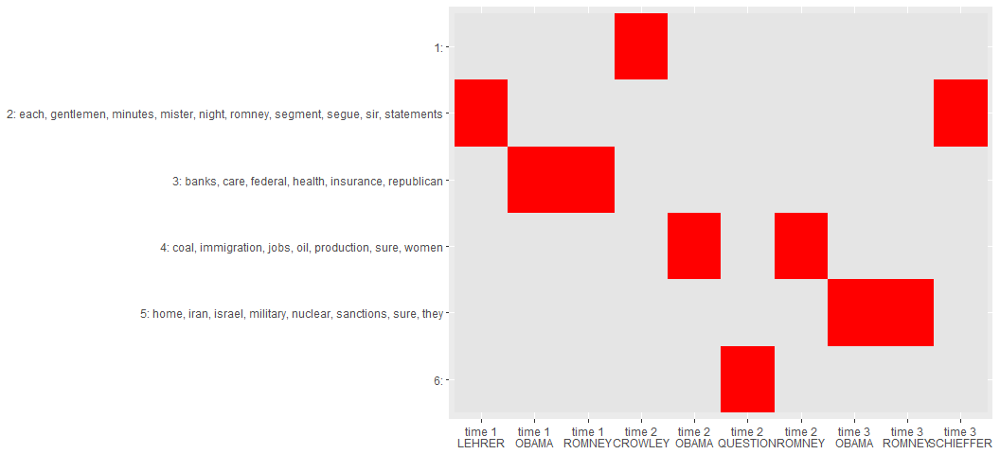

hclustext   
============

**hclustext** is a collection of optimized tools for clustering text
data via hierarchical clustering. There are many great R [clustering
tools](https://cran.r-project.org/web/views/Cluster.html) to locate
topics within documents. I have had success with hierarchical clustering
for topic extraction. This package wraps many of the great R tools for
clustering and working with sparse matrices to aide in the workflow
associated with topic extraction.

The general idea is that we turn the documents into a matrix of words.
After this we weight the terms by importance using
[tf-idf](http://nlp.stanford.edu/IR-book/html/htmledition/tf-idf-weighting-1.html).
This helps the more salient words to rise to the top. We then apply
cosine distance measures to compare the terms (or features) of each
document. Cosine distance works well with sparse matrices to produce
distances metrics between the documents. The hierarchical clustering is
fit to separate the documents into clusters. The user then may apply k
clusters to the fit, clustering documents with similar important text
features. The documents can then be grouped by clusters and their
accompanying salient words extracted as well.

Table of Contents
============

-   [[Functions](#functions)](#[functions](#functions))
-   [[Installation](#installation)](#[installation](#installation))
-   [[Contact](#contact)](#[contact](#contact))
-   [[Demonstration](#demonstration)](#[demonstration](#demonstration))
    -   [[Load Packages and Data](#load-packages-and-data)](#[load-packages-and-data](#load-packages-and-data))
    -   [[Data Structure](#data-structure)](#[data-structure](#data-structure))
    -   [[Fit the Model: Hierarchical Cluster](#fit-the-model-hierarchical-cluster)](#[fit-the-model-hierarchical-cluster](#fit-the-model-hierarchical-cluster))
    -   [[Assigning Clusters](#assigning-clusters)](#[assigning-clusters](#assigning-clusters))
        -   [[Cluster Loading](#cluster-loading)](#[cluster-loading](#cluster-loading))
        -   [[Cluster Text](#cluster-text)](#[cluster-text](#cluster-text))
        -   [[Cluster Frequent Terms](#cluster-frequent-terms)](#[cluster-frequent-terms](#cluster-frequent-terms))
        -   [[Clusters, Terms, and Docs Plot](#clusters-terms-and-docs-plot)](#[clusters-terms-and-docs-plot](#clusters-terms-and-docs-plot))
    -   [[Putting it Together](#putting-it-together)](#[putting-it-together](#putting-it-together))

Functions
============

The main functions, task category, & descriptions are summarized in the
table below:

<table style="width:160%;">
<colgroup>
<col width="34%" />
<col width="23%" />
<col width="101%" />
</colgroup>
<thead>
<tr class="header">
<th align="left">Function</th>
<th align="left">Category</th>
<th align="left">Description</th>
</tr>
</thead>
<tbody>
<tr class="odd">
<td align="left"><code>data_store</code></td>
<td align="left">data structure</td>
<td align="left"><strong>hclustext</strong>'s data structure (list of dtm + text)</td>
</tr>
<tr class="even">
<td align="left"><code>hierarchical_cluster</code></td>
<td align="left">cluster fit</td>
<td align="left">Fits a hierarchical cluster model</td>
</tr>
<tr class="odd">
<td align="left"><code>assign_cluster</code></td>
<td align="left">assignment</td>
<td align="left">Assigns cluster to document/text element</td>
</tr>
<tr class="even">
<td align="left"><code>get_text</code></td>
<td align="left">extraction</td>
<td align="left">Get text from various <strong>hclustext</strong> objects</td>
</tr>
<tr class="odd">
<td align="left"><code>get_dtm</code></td>
<td align="left">extraction</td>
<td align="left">Get <code>tm::DocumentTermMatrix</code> from various <strong>hclustext</strong> objects</td>
</tr>
<tr class="even">
<td align="left"><code>get_removed</code></td>
<td align="left">extraction</td>
<td align="left">Get removed text elements from various <strong>hclustext</strong> objects</td>
</tr>
<tr class="odd">
<td align="left"><code>get_terms</code></td>
<td align="left">extraction</td>
<td align="left">Get weighted important terms from an <strong>assign_cluster</strong> object</td>
</tr>
</tbody>
</table>

Installation
============

To download the development version of **hclustext**:

Download the [zip
ball](https://github.com/trinker/hclustext/zipball/master) or [tar
ball](https://github.com/trinker/hclustext/tarball/master), decompress
and run `R CMD INSTALL` on it, or use the **pacman** package to install
the development version:

    if (!require("pacman")) install.packages("pacman")
    pacman::p_load_gh(
        "trinker/textshape", 
        "trinker/gofastr", 
        "trinker/termco",    
        "trinker/hclustext"
    )

Contact
=======

You are welcome to:   
* submit suggestions and bug-reports at: <https://github.com/trinker/hclustext/issues>   
* send a pull request on: <https://github.com/trinker/hclustext/>  
* compose a friendly e-mail to: <tyler.rinker@gmail.com>

Demonstration
=============

Load Packages and Data
----------------------

    if (!require("pacman")) install.packages("pacman")
    pacman::p_load(hclustext, dplyr, textshape, ggplot2, tidyr)

    data(presidential_debates_2012)

Data Structure
--------------

The data structure for **hclustext** is very specific. The
`data_storage` produces a `DocumentTermMatrix` which maps to the
original text. The empty/removed documents are tracked within this data
structure, making subsequent calls to cluster the original documents and
produce weighted important terms more robust. Making the `data_storage`
object is the first step to analysis.

We can give the `DocumentTermMatrix` rownames via the `doc.names`
argument. If these names are not unique they will be combined into a
single document as seen below. Also, if you want to do stemming, minimum
character length, stopword removal or such this is when/where it's done.

    ds <- with(
        presidential_debates_2012,
        data_store(dialogue, doc.names = paste(person, time, sep = "_"))
    )

    ds

    ## Text Elements      : 10
    ## Elements Removed   : 0
    ## Documents          : 10
    ## Terms              : 3,369
    ## Non-/sparse entries: 7713/25977
    ## Sparsity           : 77%
    ## Maximal term length: 16

Fit the Model: Hierarchical Cluster
-----------------------------------

Next we can fit a hierarchical cluster model to the `data_store` object
via `hierarchical_cluster`.

    myfit <- hierarchical_cluster(ds)

    myfit

    ## 
    ## Call:
    ## fastcluster::hclust(d = cosine_distance(x[["dtm"]]), method = method)
    ## 
    ## Cluster method   : ward.D 
    ## Number of objects: 10

This object can be plotted with various `k` or `h` parameters specified
to experiment with cutting the dendrogram. This cut will determine the
number of clusters or topics that will be generated in the next step.
The visual inspection allows for determining how to cluster the data as
well as determining if a tf-idf, cosine, hierarchical cluster model is a
right fit for the data and task. By default `plot` uses an approximation
of `k` based on Can & Ozkarahan's (1990) formula (*m* \* *n*)/*t* where
*m* and *n* are the dimensions of the matrix and *t* is the length of
the non-zero elements in matrix *A*.

-   Can, F., Ozkarahan, E. A. (1990). Concepts and effectiveness of the
    cover-coefficient-based clustering methodology for text databases.
    *ACM Transactions on Database Systems 15* (4): 483.
    <doi:10.1145/99935.99938>

Interestingly, in the plots below where `k = 6` clusters, the model
groups each of the candidates together at each of the debate times.

    plot(myfit)

    ## 
    ## k approximated to: 4

    plot(myfit, k=6)

    plot(myfit, h = .75)

Assigning Clusters
------------------

The `assign_cluster` function allows the user to dictate the umber of
clusters. Because the model has already been fit the cluster assignment
is merely selecting the branches from the dendrogram, and is thus very
quick. Unlike many clustering techniques the number of clusters is done
after the model is fit, this allows for speedy cluster assignment,
meaning the user can experiment with the number of clusters.

    ca <- assign_cluster(myfit, k = 6)

    ca

    ##   CROWLEY_time 2    LEHRER_time 1     OBAMA_time 1     OBAMA_time 2 
    ##                1                2                3                4 
    ##     OBAMA_time 3  QUESTION_time 2    ROMNEY_time 1    ROMNEY_time 2 
    ##                5                6                3                4 
    ##    ROMNEY_time 3 SCHIEFFER_time 3 
    ##                5                2

### Cluster Loading

To check the number of documents loading on a cluster there is a
`summary` method for `assign_cluster` which provides a descending data
frame of clusters and counts. Additionally, a horizontal bar plot shows
the document loadings on each cluster.

    summary(ca)

    ##   cluster count
    ## 1       2     2
    ## 2       3     2
    ## 3       4     2
    ## 4       5     2
    ## 5       1     1
    ## 6       6     1

### Cluster Text

The user can grab the texts from the original documents grouped by
cluster using the `get_text` function. Here I do a 40 character
substring of the document texts.

    get_text(ca) %>%
        lapply(substring, 1, 40)

    ## $`1`
    ## [1] "Good evening from Hofstra University in "
    ## 
    ## $`2`
    ## [1] "We'll talk about specifically about heal"
    ## [2] "Good evening from the campus of Lynn Uni"
    ## 
    ## $`3`
    ## [1] "Jim, if I if I can just respond very qui"
    ## [2] "What I support is no change for current "
    ## 
    ## $`4`
    ## [1] "Jeremy, first of all, your future is bri"
    ## [2] "Thank you, Jeremy. I appreciate your you"
    ## 
    ## $`5`
    ## [1] "Well, my first job as commander in chief"
    ## [2] "Thank you, Bob. And thank you for agreei"
    ## 
    ## $`6`
    ## [1] "Mister President, Governor Romney, as a "

### Cluster Frequent Terms

As with many topic clustering techniques it is useful to get the to
salient terms from the model. The `get_terms` function uses the
[min-max](https://en.wikipedia.org/wiki/Feature_scaling#Rescaling)
scaled, [tf-idf weighted](https://en.wikipedia.org/wiki/Tf%E2%80%93idf),
`DocumentTermMatrix` to extract the most frequent salient terms. These
terms can give a sense of the topic being discussed. Notice the absence
of clusters 1 & 6. This is a result of only a single document included
in each of the clusters.

    get_terms(ca, .075)

    ## $`2`
    ##          term n
    ## 1        each 2
    ## 2   gentlemen 2
    ## 3          go 2
    ## 4       leave 2
    ## 5     minutes 2
    ## 6      mister 2
    ## 7       night 2
    ## 8      romney 2
    ## 9     segment 2
    ## 10      segue 2
    ## 11        sir 2
    ## 12 statements 2
    ## 
    ## $`3`
    ##          term n
    ## 1       banks 2
    ## 2       board 2
    ## 3        care 2
    ## 4     federal 2
    ## 5      health 2
    ## 6   insurance 2
    ## 7    medicare 2
    ## 8        plan 2
    ## 9  republican 2
    ## 10     that's 2
    ## 11       they 2
    ## 
    ## $`4`
    ##          term n
    ## 1        coal 2
    ## 2 immigration 2
    ## 3        jobs 2
    ## 4         oil 2
    ## 5  production 2
    ## 6        sure 2
    ## 7      that's 2
    ## 8       women 2
    ## 
    ## $`5`
    ##         term n
    ## 1       home 2
    ## 2       iran 2
    ## 3     israel 2
    ## 4   military 2
    ## 5    nuclear 2
    ## 6  sanctions 2
    ## 7      stand 2
    ## 8       sure 2
    ## 9       they 2
    ## 10    threat 2
    ## 11    troops 2

### Clusters, Terms, and Docs Plot

Here I plot the clusters, terms, and documents (grouping variables)
together as a combined heatmap. This can be useful for viewing &
comparing what documents are clustering together in the context of the
cluster's salient terms. This example also shows how to use the cluster
terms as a lookup key to extract probable salient terms for a given
document.

    key <- data_frame(
        cluster = 1:6,
        labs = get_terms(ca, .085) %>%
            bind_list("cluster") %>%
            select(-n) %>%
            group_by(cluster) %>%
            summarize(term=paste(term, collapse=", ")) %>%
            apply(1, paste, collapse=": ") %>%
            c("1:", ., "6:")
    )

    ca %>%
        bind_vector("id", "cluster") %>%
        separate(id, c("person", "time"), sep="_") %>%
        tbl_df() %>%
        left_join(key) %>%
        mutate(n = 1) %>%
        mutate(labs = factor(labs, levels=rev(key[["labs"]]))) %>%
        unite("time_person", time, person, sep="\n") %>%
        select(-cluster) %>%
        complete(time_person, labs) %>%  
        mutate(n = factor(ifelse(is.na(n), FALSE, TRUE))) %>%
        ggplot(aes(time_person, labs, fill = n)) +
            geom_tile() +
            scale_fill_manual(values=c("grey90", "red"), guide=FALSE) +
            labs(x=NULL, y=NULL) 

    ## Joining by: "cluster"

Putting it Together
-------------------

I like working in a chain. In the setup below we work within a
**magrittr** pipeline to fit a model, select clusters, and examine the
results. In this example I do not condense the 2012 Presidential Debates
data by speaker and timer, rather leaving every sentence as a separate
document. On my machine the initial `data_store` and model fit takes
~5-8 seconds to run. Note that I do restrict the number of clusters
texts and terms to a random 5 for the sake of space.

    .tic <- Sys.time()

    myfit2 <- presidential_debates_2012 %>%
        with(data_store(dialogue)) %>%
        hierarchical_cluster()

    difftime(Sys.time(), .tic)

    ## Time difference of 5.734812 secs

    ## View Document Loadings
    ca2 <- assign_cluster(myfit2, k = 100)
    summary(ca2)

    ##     cluster count
    ## 1         7   692
    ## 2         3   368
    ## 3        33   133
    ## 4         5   106
    ## 5        59    67
    ## 6         8    57
    ## 7        61    51
    ## 8        53    48
    ## 9        13    47
    ## 10       27    41
    ## 11       38    40
    ## 12       12    37
    ## 13       29    37
    ## 14       45    31
    ## 15       32    29
    ## 16       43    28
    ## 17       40    27
    ## 18       44    27
    ## 19       50    27
    ## 20        2    25
    ## 21       30    24
    ## 22       34    24
    ## 23       36    23
    ## 24       55    23
    ## 25       31    22
    ## 26       37    22
    ## 27        1    21
    ## 28       24    21
    ## 29       63    20
    ## 30       70    20
    ## 31       47    19
    ## 32       56    19
    ## 33       73    19
    ## 34       57    18
    ## 35        9    17
    ## 36       15    17
    ## 37       21    17
    ## 38       65    17
    ## 39       66    17
    ## 40       28    16
    ## 41       49    16
    ## 42       51    16
    ## 43       69    15
    ## 44       76    15
    ## 45       80    15
    ## 46       88    15
    ## 47        6    14
    ## 48       11    14
    ## 49       16    14
    ## 50       17    14
    ## 51       18    14
    ## 52       75    14
    ## 53        4    13
    ## 54       25    13
    ## 55       42    13
    ## 56       48    13
    ## 57       67    13
    ## 58       79    13
    ## 59       39    12
    ## 60       58    12
    ## 61       78    12
    ## 62       83    12
    ## 63       95    12
    ## 64       35    11
    ## 65       60    11
    ## 66       74    11
    ## 67       92    11
    ## 68       10    10
    ## 69       22    10
    ## 70       26    10
    ## 71       98    10
    ## 72       14     9
    ## 73       68     9
    ## 74       77     9
    ## 75       81     9
    ## 76       82     9
    ## 77       87     9
    ## 78       90     9
    ## 79       23     8
    ## 80       72     8
    ## 81       99     8
    ## 82      100     8
    ## 83       20     7
    ## 84       52     7
    ## 85       54     7
    ## 86       62     7
    ## 87       71     7
    ## 88       85     7
    ## 89       97     7
    ## 90       46     6
    ## 91       84     6
    ## 92       89     6
    ## 93       86     5
    ## 94       91     5
    ## 95       94     5
    ## 96       96     5
    ## 97       19     4
    ## 98       41     4
    ## 99       64     4
    ## 100      93     4

    ## Split Text into Clusters
    set.seed(3); inds <- sort(sample.int(100, 5))

    get_text(ca2)[inds] %>%
        lapply(head, 10)

    ## $`17`
    ##  [1] "One last point I want to make."                        
    ##  [2] "Now, the last point I'd make before|"                  
    ##  [3] "They put a plan out."                                  
    ##  [4] "They put out a plan, a bipartisan plan."               
    ##  [5] "Let me make one last point."                           
    ##  [6] "And Governor Romney's says he's got a five point plan?"
    ##  [7] "Governor Romney doesn't have a five point plan."       
    ##  [8] "He has a one point plan."                              
    ##  [9] "My five point plan does it."                           
    ## [10] "But the last point I want to make is this."            
    ## 
    ## $`32`
    ##  [1] "I think this is a great example."                                                                                                 
    ##  [2] "I think something this big, this important has to be done on a bipartisan basis."                                                 
    ##  [3] "Governor Romney said this has to be done on a bipartisan basis."                                                                  
    ##  [4] "This was a bipartisan idea."                                                                                                      
    ##  [5] "This is a this is an important election and I'm concerned about America."                                                         
    ##  [6] "I I know this is bigger than an election about the two of us as individuals."                                                     
    ##  [7] "It's an election about the course of America."                                                                                    
    ##  [8] "Well, think about what the governor think about what the governor just said."                                                     
    ##  [9] "This is not just a women's issue, this is a family issue, this is a middle class issue, and that's why we've got to fight for it."
    ## [10] "Mister President why don't you get in on this quickly, please?"                                                                   
    ## 
    ## $`38`
    ##  [1] "I will make sure we don't hurt the functioning of our of our marketplace and our business, because I want to bring back housing and get good jobs."                                                                                                                                                                                                                                                                                                                   
    ##  [2] "And hard pressed states right now can't all do that."                                                                                                                                                                                                                                                                                                                                                                                                                 
    ##  [3] "And everything that I've tried to do, and everything that I'm now proposing for the next four years in terms of improving our education system or developing American energy or making sure that we're closing loopholes for companies that are shipping jobs overseas and focusing on small businesses and companies that are creating jobs here in the United States, or closing our deficit in a responsible, balanced way that allows us to invest in our future."
    ##  [4] "But not just jobs, good paying jobs."                                                                                                                                                                                                                                                                                                                                                                                                                                 
    ##  [5] "I want to do that in industries, not just in Detroit, but all across the country and that means we change our tax code so we're giving incentives to companies that are investing here in the United States and creating jobs here."                                                                                                                                                                                                                                  
    ##  [6] "I expect those new energy sources to be built right here in the United States."                                                                                                                                                                                                                                                                                                                                                                                       
    ##  [7] "This is about bringing good jobs back for the middle class of America, and that's what I'm going to do."                                                                                                                                                                                                                                                                                                                                                              
    ##  [8] "And that's creating jobs."                                                                                                                                                                                                                                                                                                                                                                                                                                            
    ##  [9] "When you've got thousands of people right now in Iowa, right now in Colorado, who are working, creating wind power with good paying manufacturing jobs, and the Republican senator in that in Iowa is all for it, providing tax breaks to help this work and Governor Romney says I'm opposed."                                                                                                                                                                       
    ## [10] "Candy, I don't have a policy of stopping wind jobs in Iowa and that they're not phantom jobs."                                                                                                                                                                                                                                                                                                                                                                        
    ## 
    ## $`58`
    ##  [1] "And the question is this."                                                                   
    ##  [2] "Your question your question is one that's being asked by college kids all over this country."
    ##  [3] "Mister President, the next question is going to be for you here."                            
    ##  [4] "and the next question."                                                                      
    ##  [5] "And the next question is for you."                                                           
    ##  [6] "Governor, this question is for you."                                                         
    ##  [7] "And Mister President, the next question is for you, so stay standing."                       
    ##  [8] "And it's Katherine Fenton, who has a question for you."                                      
    ##  [9] "Well, Katherine, that's a great question."                                                   
    ## [10] "But the president does get this question."                                                   
    ## 
    ## $`80`
    ##  [1] "Natural gas production is the highest it's been in decades."                                                                                                                                                                                                      
    ##  [2] "We have seen increases in coal production and coal employment."                                                                                                                                                                                                   
    ##  [3] "Look, I want to make sure we use our oil, our coal, our gas, our nuclear, our renewables."                                                                                                                                                                        
    ##  [4] "But what we don't need is to have the president keeping us from taking advantage of oil, coal and gas."                                                                                                                                                           
    ##  [5] "This has not been Mister Oil, or Mister Gas, or Mister Coal."                                                                                                                                                                                                     
    ##  [6] "I was in coal country."                                                                                                                                                                                                                                           
    ##  [7] "The head of the EPA said, You can't build a coal plant."                                                                                                                                                                                                          
    ##  [8] "And natural gas isn't just appearing magically."                                                                                                                                                                                                                  
    ##  [9] "And when I hear Governor Romney say he's a big coal guy, I mean, keep in mind, when Governor, when you were governor of Massachusetts, you stood in front of a coal plant and pointed at it and said, This plant kills, and took great pride in shutting it down."
    ## [10] "With respect to something like coal, we made the largest investment in clean coal technology, to make sure that even as we're producing more coal, we're producing it cleaner and smarter."

    ## Get Associated Terms
    get_terms(ca2)[inds]

    ## $`17`
    ## NULL
    ## 
    ## $`32`
    ##         term n
    ## 1     please 3
    ## 2 bipartisan 2
    ## 3    mistake 2
    ## 
    ## $`38`
    ##        term n
    ## 1 investing 2
    ## 2      jobs 2
    ## 
    ## $`58`
    ## NULL
    ## 
    ## $`80`
    ##   term n
    ## 1 coal 3